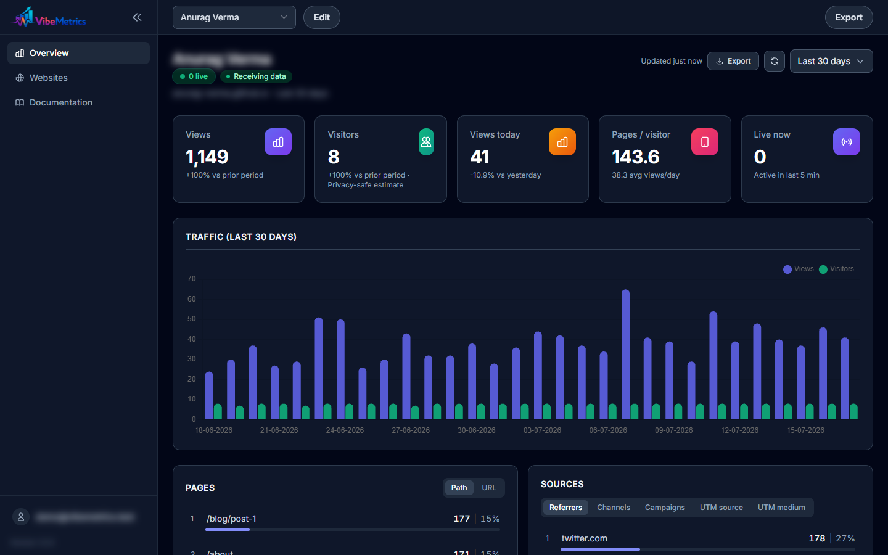
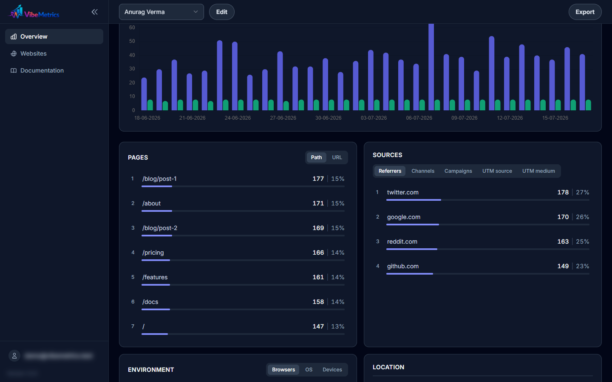
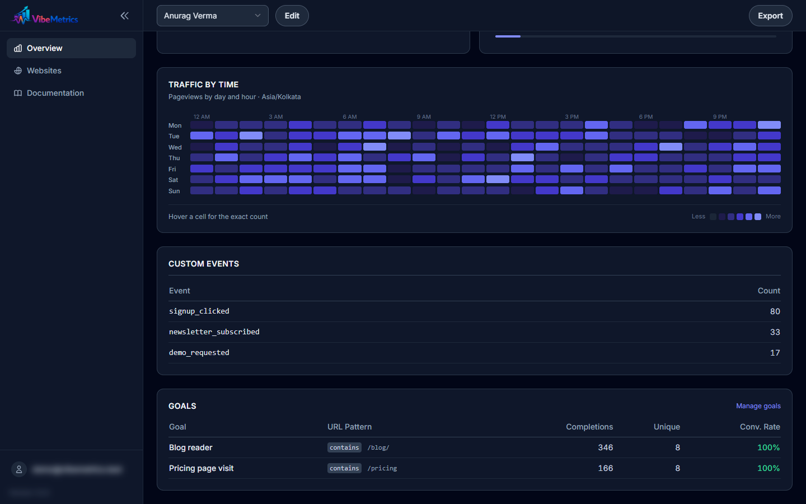
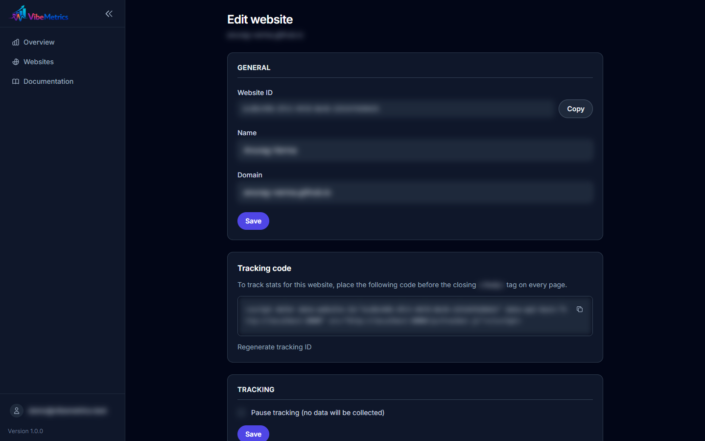
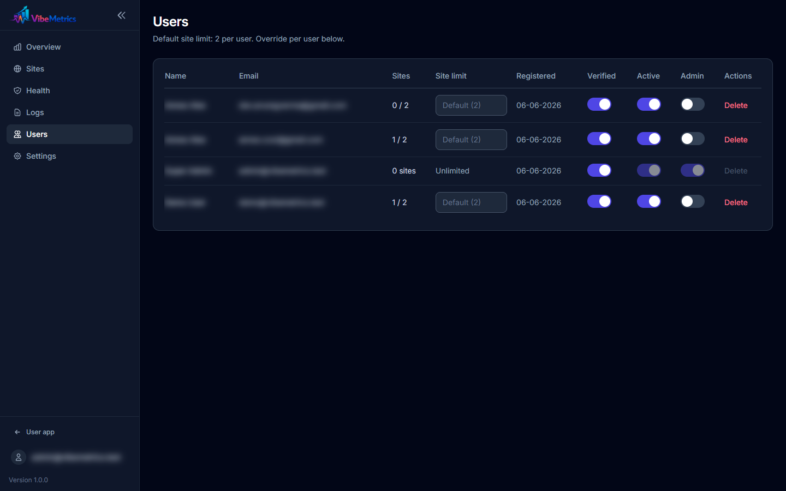
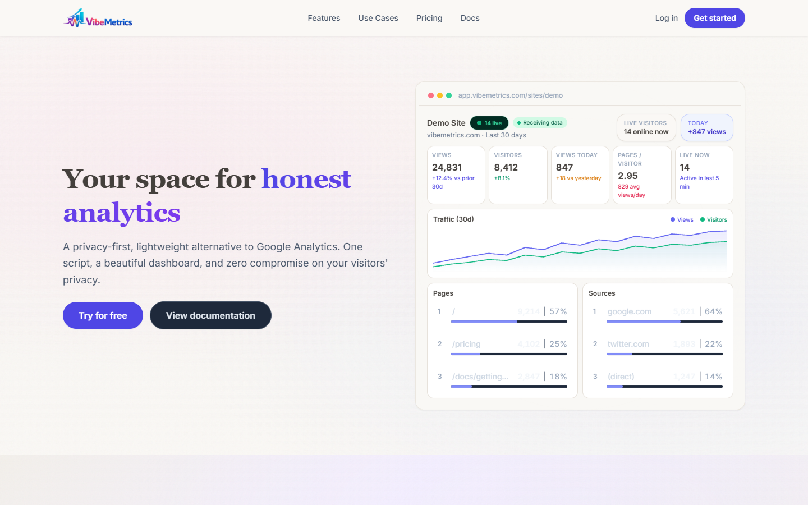

# VibeMetrics


Privacy-first web analytics built with Laravel 12, Inertia, and Vue 3. Lightweight page-view tracking with no cookies and no IP storage.

## Screenshots

| Dashboard overview | Traffic chart & sources | Goals & custom events |
| --- | --- | --- |
|  |  |  |

| Site settings & snippet | Admin panel | Landing page |
| --- | --- | --- |
|  |  |  |

## Requirements

- PHP 8.2+
- Composer
- Node.js 18+ and npm
- MySQL/MariaDB or PostgreSQL (SQLite works for local development)
- A queue worker and cron scheduler in production

## Local setup

```bash
composer install
cp .env.example .env
php artisan key:generate
php artisan migrate
npm install
npm run build
php artisan serve
```

For development with hot reload:

```bash
composer run dev
```

Create an admin user manually or seed demo data:

```bash
php artisan db:seed
```

Default seeded accounts (local only):

- Admin: `admin@vibemetrics.test` / `password`
- User: `demo@vibemetrics.test` / `password`

## Documentation

Full A–Z guides (split by topic): **[docs/guides/README.md](docs/guides/README.md)**

## Production deployment

Detailed CI/CD guides:

- **[Hostinger shared hosting](docs/deployment/HOSTINGER-SHARED-CICD.md)** — no npm on server, GitHub Actions builds assets
- **[VPS / cloud](docs/deployment/VPS-CLOUD-CICD.md)** — Nginx, Supervisor, full stack

GitHub Actions workflows: `.github/workflows/ci.yml`, `deploy-hostinger.yml`, `deploy-vps.yml`

### 1. Upload code

Deploy the project to your server. Point the web server document root to the `public/` directory (not the project root).

### 2. Environment

Copy `.env.example` to `.env` and set production values:

```env
APP_ENV=production
APP_DEBUG=false
APP_URL=https://your-domain.com

DB_CONNECTION=mysql
DB_HOST=127.0.0.1
DB_DATABASE=vibemetrics
DB_USERNAME=...
DB_PASSWORD=...

SESSION_SECURE_COOKIE=true
SESSION_ENCRYPT=true

MAIL_MAILER=smtp
MAIL_HOST=...
MAIL_USERNAME=...
MAIL_PASSWORD=...
MAIL_FROM_ADDRESS=hello@your-domain.com
```

Generate the app key if this is a fresh install:

```bash
php artisan key:generate
```

### 3. Install dependencies and build assets

```bash
composer install --no-dev --optimize-autoloader
npm ci
npm run build
```

### 4. Database and storage

```bash
php artisan migrate --force
php artisan storage:link
```

Ensure `storage/` and `bootstrap/cache/` are writable by the web server.

### 5. Optimize Laravel

```bash
php artisan config:cache
php artisan route:cache
php artisan view:cache
```

### 6. Queue worker (required)

Page views are queued before being written. Run a persistent worker:

```bash
php artisan queue:work --tries=3
```

Use Supervisor or systemd to keep the worker running.

### 7. Scheduler (required)

Daily rollups and data purges depend on the scheduler:

```cron
* * * * * cd /path/to/vibemetrics && php artisan schedule:run >> /dev/null 2>&1
```

Scheduled tasks:

- `analytics:rollup` — daily at 01:00
- `analytics:purge` — weekly

### 8. Verify health

- Visit `https://your-domain.com/up` — should return healthy
- Log in as admin and open **Admin → Health** to confirm database, cache, queue, storage, and scheduler checks

## Tracking snippet

After creating a site, embed the generated snippet on your website:

```html
<script defer data-website-id="YOUR_TRACKING_ID" data-api-host="https://your-domain.com" src="https://your-domain.com/js/tracker.js"></script>
```

Events are sent to `POST /api/collect`.

## Admin platform settings

Configurable from **Admin → Settings**:

| Setting | Purpose |
|---------|---------|
| `collect_rate_limit` | Max ingest requests per IP per minute |
| `maintenance_mode` | Blocks new event collection (returns 503) |
| `registration_enabled` | Allow or block new sign-ups |
| `rollup_enabled` | Enable/disable daily stat aggregation |
| `retention_days` | How long raw page views are kept |
| `max_sites_per_user` | Site limit per non-admin user |

## Testing

```bash
composer test
```

Or:

```bash
php artisan test
```

## Apache (XAMPP / shared hosting)

The `public/.htaccess` file is included. Ensure `mod_rewrite` is enabled and `AllowOverride All` is set for the site directory.

## Security notes

- Never commit `.env` to version control
- Set `APP_DEBUG=false` in production
- Use HTTPS and `SESSION_SECURE_COOKIE=true`
- Keep `vendor/` and `node_modules/` off the public web root

## License

MIT
